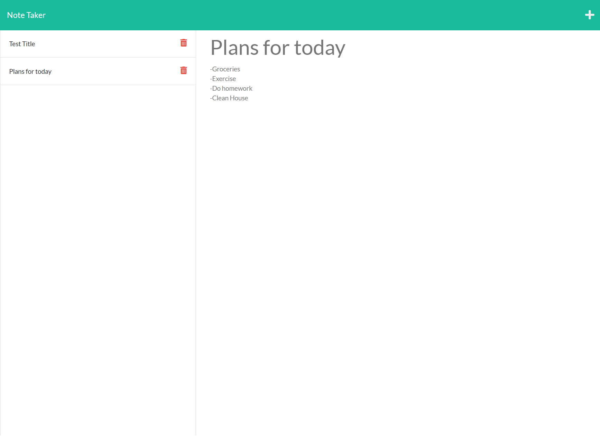

# Note-Collector

## Description
This is a ReadMe generator that can create future project ReadMe's in a much more efficient way. Simply clone the repository for yourself then use node.js to a series of prompts will ask you about your project info that will be inputed into your README file.

---

## Table of Contents

- [Preview](#Preview)

- [Links](#links)

-[]

---

## Preview

---

## Links

Here is the link through Heroku: 
---